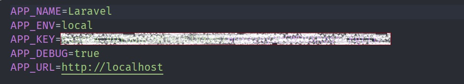
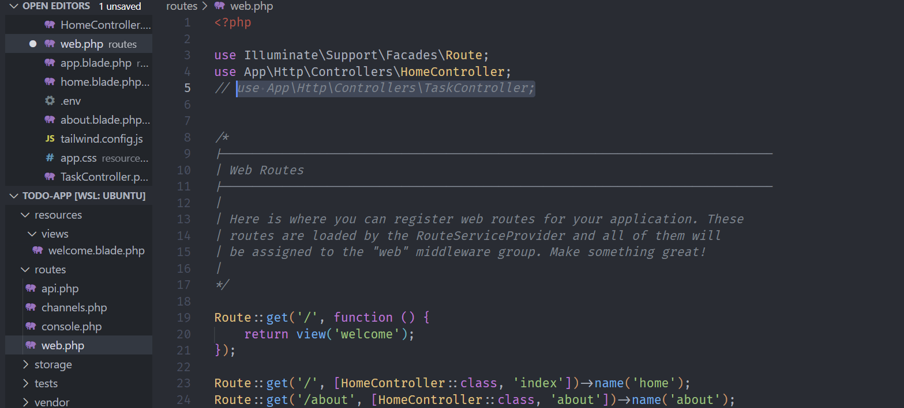

# Lucrare de laborator nr. 2. Cereri HTTP și șablonizare în Laravel

## Scopul lucrării

Să se studieze principiile de bază ale lucrului cu cererile HTTP în Laravel și șablonizarea folosind Blade, pe baza unei aplicații web „To-Do App pentru echipe” — o aplicație pentru gestionarea sarcinilor în cadrul unei echipe.

Aplicația este destinată unei echipe care dorește să își gestioneze sarcinile, să le atribuie membrilor și să monitorizeze starea și prioritatea sarcinilor (similar cu Github Issues).

## Condiții

### Nr. 1. Pregătirea pentru lucru, instalarea Laravel

1. Deschideți terminalul și creați un nou proiect Laravel cu numele todo-app (numele proiectului poate fi orice) folosind Composer: bash composer create-project laravel/laravel:^10 todo-app
2. Intrați în directorul proiectului: bash cd todo-app
3. Porniți serverul încorporat Laravel: bash php artisan serve

- Întrebare: Ce vedeți în browser când deschideți pagina `http://localhost:8000?`

* Când deschid pagina [http://localhost:8000](http://localhost:8000) după ce am pornit serverul încorporat Laravel cu comanda `php artisan serve`, apare pagina implicită de bun venit a Laravel.

Această pagină afișează un mesaj de tip **"Laravel"**.
Este o pagină de test care confirmă că Laravel a fost instalat și configurat corect și că serverul local funcționează.

### Nr. 2. Configurarea mediului

1. Deschideți fișierul .env și setați următoarele configurări ale aplicației: ini APP_NAME=ToDoApp APP_ENV=local APP_KEY= APP_DEBUG=true APP_URL=http://localhost:8000
2. Generați cheia aplicației, care va fi utilizată pentru criptarea datelor: bash php artisan key:generate
   

- Întrebare: Ce s-ar întâmpla dacă această cheie ar ajunge pe mâna unui răufăcător?

* Dacă cheia aplicației setată în fișierul `.env` ar ajunge pe mâna unui răufăcător, acesta ar putea compromite securitatea aplicației. Cheia este utilizată pentru criptarea datelor sensibile, cum ar fi token-uri de autentificare, parole criptate și alte informații private. Un răufăcător ar putea:

* Decripta datele sensibile stocate în aplicație.
* Accesa și manipula informații confidențiale ale utilizatorilor.
* Genera token-uri falsificate pentru a accesa aplicația în mod neautorizat.

Practic, securitatea întregii aplicații ar fi compromisă, ceea ce ar putea duce la pierderea datelor și la încălcarea confidențialității.

### Nr. 3. Principiile de bază ale lucrului cu cererile HTTP

#### Nr. 3.1. Crearea rutelor pentru pagina principală și pagina "Despre noi"

1. Creați un controller HomeController pentru gestionarea cererilor către pagina principală.
2. Adăugați metoda index în HomeController, care va afișa pagina principală.
3. Creați ruta pentru pagina principală în fișierul routes/web.php. php public function index() { return view('home'); }

- Deschideți browserul și accesați adresa http://localhost:8000. Asigurați-vă că pagina goală se încarcă, deoarece vizualizarea home.blade.php nu a fost încă creată.

4. În același controller HomeController, creați o metodă pentru pagina "Despre noi".
   
5. Adăugați ruta pentru pagina "Despre noi" în fișierul routes/web.php.
   

#### Nr. 3.2. Crearea rutelor pentru sarcini

1. Creați un controller TaskController pentru gestionarea cererilor legate de sarcini și adăugați următoarele metode:

- index — afișarea listei de sarcini;
- create — afișarea formularului pentru crearea unei sarcini;
- store — salvarea unei sarcini noi;
- show — afișarea unei sarcini;
- edit — afișarea formularului pentru editarea unei sarcini;
- update — actualizarea sarcinii;
- destroy — ștergerea sarcinii.

- Întrebare: Explicați diferența între crearea manuală a rutelor și utilizarea unui controller de resurse. Ce rute și ce nume de rute vor fi create automat?

* Diferența între crearea manuală a rutelor și utilizarea unui controller de resurse este:

- Crearea manuală a rutelor:

* Fiecare rută trebuie să fie definită manual, ceea ce poate duce la cod duplicat și mai mult efort de gestionare.
* Control total asupra fiecărei rute, dar la un cost de complexitate.

- Utilizarea unui controller de resurse:

* Rutele sunt generate automat, ceea ce economisește timp și reduce riscul de erori.
* Rutele respectă convențiile Laravel, făcând codul mai curat și mai ușor de înțeles.
* Mai ușor de extins și întreținut, deoarece orice modificare în operațiile CRUD se poate face în controller, fără a modifica rutele.

### Nr. 4. Șablonizarea folosind Blade

#### Nr. 4.1. Crearea unui layout pentru pagini

#### Nr. 4.2. #### Nr. 4.1. Crearea unui layout pentru pagini

#### Nr. 4.3. Componente anonime Blade

#### Nr. 4.4. Stilizarea paginilor

#### Nr. 4.5. Sarcini suplimentare

## Întrebări de control

- Ce este un controller de resurse în Laravel și ce rute creează?
- Explicați diferența între crearea manuală a rutelor și utilizarea unui controller de resurse.
- Ce avantaje oferă utilizarea componentelor anonime Blade?
- Ce metode de cereri HTTP sunt folosite pentru a executa operațiunile CRUD?
