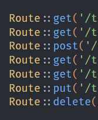
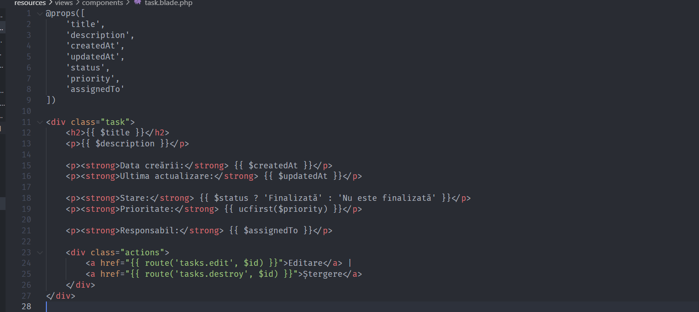
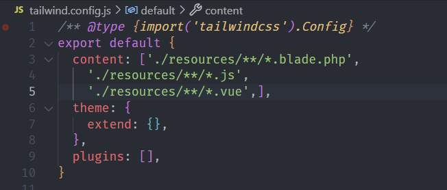
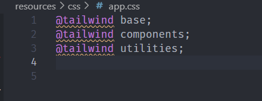

# Lucrare de laborator nr. 2. Cereri HTTP și șablonizare în Laravel

## Scopul lucrării

Să se studieze principiile de bază ale lucrului cu cererile HTTP în Laravel și șablonizarea folosind Blade, pe baza unei aplicații web „To-Do App pentru echipe” — o aplicație pentru gestionarea sarcinilor în cadrul unei echipe.

Aplicația este destinată unei echipe care dorește să își gestioneze sarcinile, să le atribuie membrilor și să monitorizeze starea și prioritatea sarcinilor (similar cu Github Issues).

## Condiții

### Nr. 1. Pregătirea pentru lucru, instalarea Laravel

1. Deschideți terminalul și creați un nou proiect Laravel cu numele todo-app (numele proiectului poate fi orice) folosind Composer: bash composer create-project laravel/laravel:^10 todo-app
2. Intrați în directorul proiectului: bash cd todo-app
3. Porniți serverul încorporat Laravel: bash php artisan serve

- Întrebare: Ce vedeți în browser când deschideți pagina `http://localhost:8000?`

* Când deschid pagina [http://localhost:8000](http://localhost:8000) după ce am pornit serverul încorporat Laravel cu comanda `php artisan serve`, apare pagina implicită de bun venit a Laravel.

Această pagină afișează un mesaj de tip **"Laravel"**.
Este o pagină de test care confirmă că Laravel a fost instalat și configurat corect și că serverul local funcționează.

### Nr. 2. Configurarea mediului

1. Deschideți fișierul .env și setați următoarele configurări ale aplicației: ini APP_NAME=ToDoApp APP_ENV=local APP_KEY= APP_DEBUG=true APP_URL=http://localhost:8000
2. Generați cheia aplicației, care va fi utilizată pentru criptarea datelor: bash php artisan key:generate
   

- Întrebare: Ce s-ar întâmpla dacă această cheie ar ajunge pe mâna unui răufăcător?

* Dacă cheia aplicației setată în fișierul `.env` ar ajunge pe mâna unui răufăcător, acesta ar putea compromite securitatea aplicației. Cheia este utilizată pentru criptarea datelor sensibile, cum ar fi token-uri de autentificare, parole criptate și alte informații private. Un răufăcător ar putea:

* Decripta datele sensibile stocate în aplicație.
* Accesa și manipula informații confidențiale ale utilizatorilor.
* Genera token-uri falsificate pentru a accesa aplicația în mod neautorizat.

Practic, securitatea întregii aplicații ar fi compromisă, ceea ce ar putea duce la pierderea datelor și la încălcarea confidențialității.

### Nr. 3. Principiile de bază ale lucrului cu cererile HTTP

#### Nr. 3.1. Crearea rutelor pentru pagina principală și pagina "Despre noi"

1. Creați un controller HomeController pentru gestionarea cererilor către pagina principală.
2. Adăugați metoda index în HomeController, care va afișa pagina principală.
3. Creați ruta pentru pagina principală în fișierul routes/web.php. php public function index() { return view('home'); }

- Deschideți browserul și accesați adresa http://localhost:8000. Asigurați-vă că pagina goală se încarcă, deoarece vizualizarea home.blade.php nu a fost încă creată.

4. În același controller HomeController, creați o metodă pentru pagina "Despre noi".
   
5. Adăugați ruta pentru pagina "Despre noi" în fișierul routes/web.php.
   

#### Nr. 3.2. Crearea rutelor pentru sarcini

1. Creați un controller TaskController pentru gestionarea cererilor legate de sarcini și adăugați următoarele metode:

- index — afișarea listei de sarcini;
- create — afișarea formularului pentru crearea unei sarcini;
- store — salvarea unei sarcini noi;
- show — afișarea unei sarcini;
- edit — afișarea formularului pentru editarea unei sarcini;
- update — actualizarea sarcinii;
- destroy — ștergerea sarcinii.

2. Creați rutele pentru metodele controllerului TaskController în fișierul routes/web.php și specificați metodele HTTP corecte pentru fiecare rută.
   
   

3. Utilizați gruparea rutelor pentru controllerul TaskController cu prefixul `/tasks` pentru a simplifica rutarea și a îmbunătăți lizibilitatea codului.
   

4. Definiți nume corecte pentru rutele controllerului TaskController, de exemplu:

- tasks.index — lista de sarcini;
- tasks.show — afișarea unei sarcini individuale.
- ...
  

5. Adăugați validarea parametrilor rutei id pentru sarcini. Asigurați-vă că parametrul id este un număr întreg pozitiv. Utilizați metoda where pentru a limita valorile parametrului id.
   

6. În loc să creați manual rute pentru fiecare metodă, puteți folosi un controller de resurse, care va crea automat rute pentru toate operațiunile CRUD:
   În fișierul routes/web.php, înlocuiți crearea manuală a rutelor pentru controllerul TaskController cu un controller de resurse: php Route::resource('tasks', TaskController::class);
   

- Întrebare: Explicați diferența între crearea manuală a rutelor și utilizarea unui controller de resurse. Ce rute și ce nume de rute vor fi create automat?

* Diferența între crearea manuală a rutelor și utilizarea unui controller de resurse este:

- Crearea manuală a rutelor:

* Fiecare rută trebuie să fie definită manual, ceea ce poate duce la cod duplicat și mai mult efort de gestionare.
* Control total asupra fiecărei rute, dar la un cost de complexitate.

- Utilizarea unui controller de resurse:

* Rutele sunt generate automat, ceea ce economisește timp și reduce riscul de erori.
* Rutele respectă convențiile Laravel, făcând codul mai curat și mai ușor de înțeles.
* Mai ușor de extins și întreținut, deoarece orice modificare în operațiile CRUD se poate face în controller, fără a modifica rutele.

7. Verificați rutele create cu ajutorul comenzii
   

### Nr. 4. Șablonizarea folosind Blade

#### Nr. 4.1. Crearea unui layout pentru pagini

1. Creați un layout pentru paginile principale layouts/app.blade.php cu următoarele elemente comune ale paginii:

- Titlul paginii;
- Meniu de navigare;
- Conținutul paginii.

2. Folosiți directiva @yield pentru a defini zona în care va fi inserat conținutul diferitelor pagini.
   

#### Nr. 4.2. Utilizarea șabloanelor Blade

1. Creați vizualizarea pentru pagina principală home.blade.php folosind layoutul layouts/app.blade.php în directorul resources/views.
   

2. Pe pagina principală trebuie să fie:

- Mesaj de bun venit: titlu și o scurtă descriere a aplicației, de exemplu „To-Do App pentru echipe”.
- Navigație: linkuri către secțiunile principale, cum ar fi:
  Lista de sarcini, crearea unei sarcini.
- Informații despre aplicație: o scurtă descriere a scopului aplicației și a principalelor sale funcții.
  

3. Creați vizualizarea pentru pagina "Despre noi" — about.blade.php folosind layoutul layouts/app.blade.php în directorul resources/views.
   
4. Creați vizualizări pentru sarcini cu următoarele șabloane în directorul resources/views/tasks:

- index.blade.php — lista de sarcini;
- show.blade.php — afișarea unei sarcini;
- ...
  

5. Randați lista de sarcini pe pagina index.blade.php folosind date statice transmise din controller cu ajutorul directivei @foreach.
   

#### Nr. 4.3. Componente anonime Blade

1. Creați o componentă anonimă pentru afișarea antetului (header). Folosiți componenta creată în layoutul layouts/app.blade.php.
   
2. Creați o componentă anonimă pentru afișarea sarcinilor:

- Componenta trebuie să fie simplă și să folosească parametri transmiși prin directiva @props. Acest lucru va face șabloanele mai flexibile și reutilizabile pe diverse pagini.
- Componenta trebuie să afișeze informații despre sarcină:
  Titlul sarcinii;
  Descrierea sarcinii;
  Data creării sarcinii;
  Data actualizării sarcinii;
  Acțiuni asupra sarcinii (editare, ștergere);
  Starea sarcinii (finalizată/nu este finalizată);
  Prioritatea sarcinii (scăzută/medie/ridicată);
  Responsabilul sarcinii (Assignment), adică numele utilizatorului căruia i-a fost atribuită sarcina.
  
  

3. Afișați componenta de sarcină creată pe pagina show.blade.php folosind parametrii transmiși.
   
   

#### Nr. 4.4. Stilizarea paginilor

Stilizarea paginilor utilizand biblioteca de stiluri Tailwind CSS.

1. Instalarea Tailwind CSS
   `npm install -D tailwindcss postcss autoprefixer`
   `npx tailwindcss init`
   Aceasta va crea un fișier de configurare `tailwind.config.js` în directorul rădăcină al proiectului.
2. Configurarea Tailwind CSS
   
3. Crearea fișierului CSS
   `mkdir -p resources/css`
   `touch resources/css/app.css`
   În `app.css` adaugăm următorul cod:
   
4. Compilarea CSS-ului
   
5. Includerea CSS-ului în layout
   

## Întrebări de control

1. Ce este un controller de resurse în Laravel și ce rute creează?
   Un **controller de resurse** în Laravel este un tip special de controller care gestionează resursele CRUD (Create, Read, Update, Delete) pentru un model specific. Laravel facilitează crearea automată a rutelor asociate cu aceste operațiuni prin utilizarea unei comenzi Artisan.

Un controller de resurse creează următoarele rute implicite:

- `GET /tasks` – index (lista tuturor resurselor)
- `GET /tasks/create` – create (formular pentru crearea unei noi resurse)
- `POST /tasks` – store (salvarea unei noi resurse)
- `GET /tasks/{id}` – show (afișarea detaliilor unei resurse specifice)
- `GET /tasks/{id}/edit` – edit (formular pentru editarea unei resurse existente)
- `PUT/PATCH /tasks/{id}` – update (actualizarea unei resurse existente)
- `DELETE /tasks/{id}` – destroy (ștergerea unei resurse existente)

2. Explicați diferența între crearea manuală a rutelor și utilizarea unui controller de resurse.

- **Crearea manuală a rutelor** implică definirea fiecărei rute individual, specificând metoda HTTP și acțiunea controller-ului. Aceasta oferă flexibilitate, dar poate deveni rapid complexă și mai greu de întreținut pe măsură ce numărul de rute crește.

- **Utilizarea unui controller de resurse** simplifică această sarcină, generând automat rutele standard pentru operațiunile CRUD. Acest lucru nu doar că reduce boilerplate-ul din cod, dar îmbunătățește și lizibilitatea și întreținerea codului, deoarece rutele sunt grupate logic în jurul resursei.

3. Ce avantaje oferă utilizarea componentelor anonime Blade?
   **Componentele anonime Blade** oferă mai multe avantaje:

- **Reutilizare**: Permite reutilizarea codului în diverse părți ale aplicației, facilitând astfel gestionarea componentelor UI.
- **Organizare**: Ajută la organizarea codului în componente mici și gestionabile, îmbunătățind astfel structura și lizibilitatea codului.
- **Scalabilitate**: Poate fi folosit pentru a construi UI complexe, având componenta necesară pentru fiecare parte a interfeței utilizatorului.
- **Separarea preocupărilor**: Componenta poate conține atât logica, cât și markup-ul asociat, permițând o separare clară a preocupărilor între diferitele părți ale aplicației.

4. Ce metode de cereri HTTP sunt folosite pentru a executa operațiunile CRUD?
   Operațiunile CRUD utilizează următoarele metode de cereri HTTP:

- **Create**: `POST` – pentru a crea o nouă resursă.
- **Read**: `GET` – pentru a citi sau a vizualiza resursele existente.
- **Update**: `PUT` sau `PATCH` – pentru a actualiza o resursă existentă.
- **Delete**: `DELETE` – pentru a șterge o resursă existentă.

Aceste metode sunt esențiale pentru a interacționa cu API-urile RESTful și pentru a implementa operațiuni CRUD în aplicațiile Laravel.
